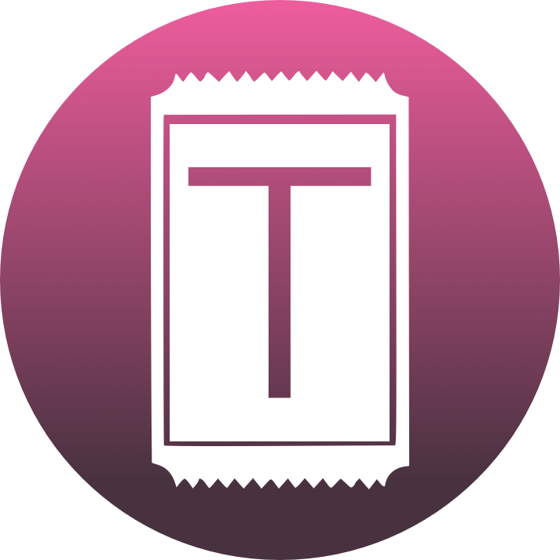
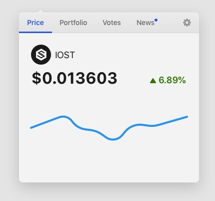
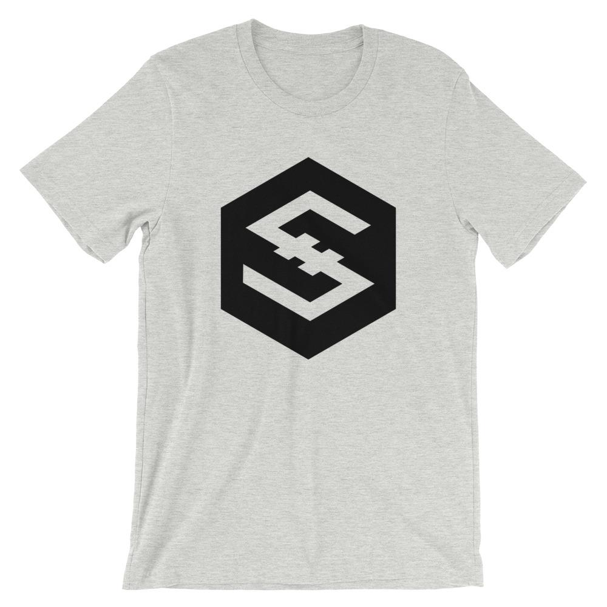

# BlockArcade

  

## 01 Introduction

Our goal with BlockArcade is to emulate the traditional arcade experience, just on the decentralized web! This vision includes arcade tokens using IOST, tickets for prizes using a custom token called TIX, and a prize counter to spend your tickets!

### Background

Jason originally built StackWave for the Bitcoin blockchain back in 2014. For the first time, he had a distributed database that no single person has to maintain, and cost effective micro-transactions under $1. Unfortunately before he could get the project out Bitcoin transaction fees and times sky rocketed. StackWave no longer worked on Bitcoin, so he shelved the project. This is a problem Bitcoin still struggles with today [@wiki:Bitcoin_scalability_problem].
With the introduction of the Lightning Network [@lightning_network] Bitcoin is an option again, but we believe there are better options out there. We’ve come a very long way since Bitcoin was originally released and we want to explore some of the other options out there.

\newpage

## 02 Technology

IOST (Internet of Services token) [@iost] is a newer blockchain that solves many of the problems with the last 3 generations of blockchains. From the start of the project they’ve focused on the user experience, and it shows! Starting with the string account names. 

Want to send me IOST? Send it to “octalmage”, it’s that easy!

Additionally, and probably the most important point:

> We were able to get our app up and running on the IOST blockchain in a weekend, and it is fast!

This says it all. We evaluated Bitcoin Lightning, EOS, and Tron for BlockArcade. After building a couple of prototypes and interacting with the different communities, IOST was the clear winner. With JavaScript as the smart contract language, great documentation, and Docker based local development tools, it was an easy choice for us.
IOST also has very quick and cheap transactions, it’s transactions per second (TPS) is already better than Bitcoin and Ethereum combined, and IOST has already surpassed Ethereum in daily transaction volume [@iost_daily_transactions_2019]. All of this makes IOST a very attractive blockchain.

The IOST team also gets bonus points for hopping on a call with me almost instantly. The second they heard we were working on an IOST app, they wanted to help, and they have! Big thanks to Bing from the IOST team! I haven’t experienced this level of support in any other community, especially not a blockchain community!

\newpage

## 03 Games

### StaveWave 

StackWave is the first game we plan to launch on BlockArcade with more games planned in the future.

StaveWave is now live on the IOST mainnet at:
https://blockarca.de

The idea is simple: Tap or click the grid to place the row of blocks. Any blocks that aren’t aligned with the previous row’s blocks are lost and removed. 

The goal is to reach the top row with at least one block!

At row 8 you'll be given the option to take the minor prize (1.2x inserted amount) or go for the jackpot (10% of the contract balance). 

Currently StaveWave accepts IOST in increments of 10, 100, or 1000. Pay 100 or more to go for the major jackpot which is 10% of the contract balance. Pay 10 IOST to go for the minor jackpot which is 1%

At the time of writing the IOST put into StackWave is distributed in this fashion:

* 2% goes to an IOST account managed by the developers, batreas. Currently we're auto-voting all of those funds to our IOST node, blockarcade. 
* 78.4% goes to the jackpot. This is kept in the StackWave contract. 
* 19.6% goes to the TIX contract to issue TIX to the user. 

We have no plans to change the 2% developer cut, but we may tweak the amount going to the jackpot or TIX contract in the future. 

StackWave payouts 1 TIX for every IOST spent playing. Users that choose to go for the major jackpot will be rewarded with a 2x payout on TIX.

\vspace*{\fill}

\tiny Chances of winning the minor and major jackpot depend on a mix of skill and chance. We've added an RNG component to keep the game fair and to keep bots from stealing the jackpot. Chances of winning the minor jackpot is ~90%, and chances of winning the major jackpot is ~1%. These percentages are subject to change in either direction based on the win rates we see.

\normalsize

\newpage

## 04 TIX Token

TIX is the digital equivalent to tickets from an arcade. TIX will reward users for playing BlockArcade games, win or loss!

TIX is an IRC20 [@iost_irc_20] token implemented on the IOST blockchain. 

TIX is exchangeable for IOST through the TIX contract at a rate of 10 TIX = 1 IOST. 

TIX total supply is 21,000,000,000 [@iostabc_token_tix]. 

After a bunch of revisions we decided to keep the TIX logo as simple and minimal as possible while still having it clearly represent a ticket. We believe this logo accomplishes that even when it's as small as 15 pixels.

\newpage

## 05 Prize Counter

The prize counter is where you can exchange TIX for prizes, similar to a traditional arcade. This is where you'll be able to trade TIX for IOST, and more. 

Currently our ideas for prizes are:

* IOST!
* Unique digital art using non-fungible tokens on IOST.
* Other IOST IRC20 coins with partner dApps.
* BlockArcade swag (shirts, stickers). 

You will also be able to trade TIX for unique collectible art pieces created by artists either in the crypto community, or in our local community (Austin, Texas). These will be implemented as non-fungible tokens in the IOST blockchain using the IRC721 standard [@iost_irc_721]. 

Our goal is to emulate the arcade as much as possible by providing a wide array of options for exchanging TIX. Any IOST left over in the TIX contract will be used for airdrops and other promotional events. 

\newpage

## 06 Roadmap

---------------------------------------------------------------------------------------------------------------------
 Current                                 Near-term                                 Future
------------------------------------- ---------------------------------------- ----------------------------------------
  Quantum Raffle                         CryptoRun                                Money Blocks
                        
  Everyone loves a good raffle!          A retro racing game where you get to     A twist on Tetris where we randomly    
  This raffle will be fun and fair       keep the IOST you pick up on the road.   drop blocks filled with IOST and TIX.
  with plenty of ways to win.            Let's see who gets the best lap time!    Clear the blocks to get the cash! 

  NFT T-Shirts for the prize exchange.   Arcade Coin                              Integrate fiat on-ramp for IOST.

                                         NFT collectibe unique art pieces for
                                         the prize exchange.
  

---------------------------------------------------------------------------------------------------------------------

Table: This is a small visual to layout a rough timeline for some of the bigger items we're working on. 

In addition to the items listed above, here's a few other roadmap items: 

**IOST Desktop**

Cross platform desktop application to allow users to keep track of their IOST accounts and perform common operations like claiming rewards and voting.

{width=50%}

Learn more: https://github.com/blockarcade/iost-desktop

\newpage

**IOST WordPress plugin** 

The plugin will allow users to sign-in to WordPress websites using their IOST account. We also plan to allow WordPress authors to accept IOST as tips for content. Both of these features will work with the IWallet Chrome extention and mobile wallets. 

Many IOST node operators use WordPress to promote their nodes and take donations so we believe this will be valuable to the community.

Learn more: https://github.com/blockarcade/wpiost

### High Quality IOST T-Shirts

We believe this will help get the attention of more developers. Our goal is to be able to offer t-shirts for TIX in at our prize counter in addition to selling them at an online store.

{width=50%}

Learn more: https://dapple.store

\newpage

## 07 Disclaimers

You should expect to play games at BlockArcade. You should expect to earn TIX at BlockArcade. You should expect to be able to exchange your TIX for prizes at BlockArcade. Most importantly you should expect to have fun at BlockArcade! You should not expect to make profits at BlockArcade, just like any traditional arcade. 

The TIX token's value is pegged to IOST at 10 TIX to 1 IOST through the TIX contract. 

The value of TIX *WILL NOT* increase. 

WE RESERVE THE RIGHT TO BLOCK PLAYERS AT ANY POINT FOR ANY REASON. When this happens the player will be unable to start new games.

THE SOFTWARE IS PROVIDED "AS IS", WITHOUT WARRANTY OF ANY KIND, EXPRESS OR IMPLIED, INCLUDING BUT NOT LIMITED TO THE WARRANTIES OF MERCHANTABILITY, FITNESS FOR A PARTICULAR PURPOSE AND NONINFRINGEMENT. IN NO EVENT SHALL THE AUTHORS OR COPYRIGHT HOLDERS BE LIABLE FOR ANY CLAIM, DAMAGES OR OTHER LIABILITY, WHETHER IN AN ACTION OF CONTRACT, TORT OR OTHERWISE, ARISING FROM, OUT OF OR IN CONNECTION WITH THE SOFTWARE OR THE USE OR OTHER DEALINGS IN THE SOFTWARE.

## 08 References