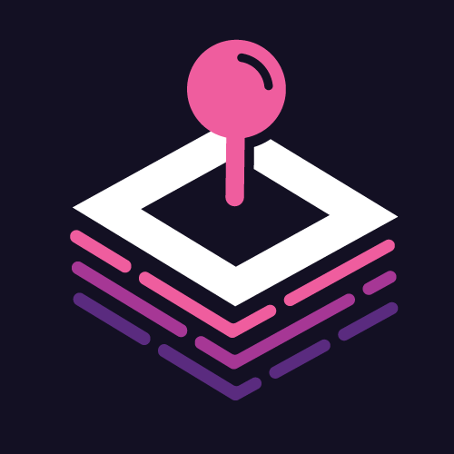

# BlockArcade

  

## 01 Introduction

Our goal with BlockArcade is to emulate the traditional arcade experience, just on the decentralized web! This vision includes arcade tokens using IOST, tickets for prizes using a custom token called TIX, and a prize counter to spend your tickets!

## 02 Technology

IOST (Internet of Services token) is a newer blockchain that solves many of the problems with the last 3 generations of blockchains. From the start of the project they’ve focused on the user experience, and it shows! Starting with the string account names. 

Want to send me IOST? Send it to “octalmage”, it’s that easy!

Additionally, and probably the most important point:

> We were able to get our app up and running on the IOST blockchain in a weekend, and it is fast!

This says it all. We evaluated Bitcoin Lightning, EOS, and Tron for BlockArcade. After building a couple of prototypes and interacting with the different communities, IOST was the clear winner. With JavaScript as the smart contract language, great documentation, and Docker based local development tools, IOST won over my robotic developer heart.
IOST also has very quick and cheap transactions, it’s transactions per second (TPS) is already better than Bitcoin and Ethereum combined, and IOST has already surpassed Ethereum in daily transaction volume [@iost_daily_transactions_2019]. All of this makes IOST a very attractive blockchain.

The IOST team also gets bonus points for hopping on a call with me almost instantly. The second they heard we were working on an IOST app, they wanted to help, and they have! Big thanks to Bing from the IOST team! I haven’t experienced this level of support in any other community, especially not a blockchain community! Bitcoin devs were anonymous (in the early days), Ethereum devs were unreachable celebrities (in my eyes), and I couldn’t find a good developer community for Tron.

## 03 Games

### StaveWave 

StackWave is the first game we plan to launch on BlockArcade with more games planned in the future.

StaveWave is currently live on the IOST mainnet at:
https://blockarca.de

The idea is simple: Tap or click the grid to place the row of blocks. Any blocks that aren’t aligned with the previous row’s blocks are lost and removed. 

The goal is to reach the top row with at least one block!

At row 8 you'll be giving the option to take the minor prize (1.2x inserted amount) or go for the jackpot (10% of the contract balance). 

Currently StaveWave accepts IOST in increments of 10, 100, or 1000. Pay 100 or more to go for the major jackpot which is 10% of the contract balance. Pay 10 IOST to go for the minor jackpot which is 1%

At the time of writing the IOST put into StackWave is distributed in this fashion:

* 1.2% goes to an IOST account managed by the developers, batreas. Currently we're auto-voting all of those funds to our IOST node, blockarcade. 
* 74.1% goes to the jackpot. This is kept in the StackWave contract. 
* 24.7% goes to the TIX contract to issue TIX to the user. 

We have no plans to change the 1.2% developer cut, but we may tweak the amount going to the jackpot or TIX contract in the future. 

StackWave payouts 1 TIX for every IOST spent playing. Users that choose to go for the major jackpot will be rewarded with a 2x payout on TIX. 

## 04 TIX Token

TIX is the digital equivalent to tickets from an arcade. TIX is meant to reward users for playing BlockArcade games. 

TIX is an IRC20 [@iost_irc_20] token implemented on the IOST blockchain. 

TIX is exchangeable for IOST through the TIX contract at a rate of 10 TIX = 1 IOST. 

TIX total supply is 21,000,000,000 [@iostabc_token_tix]. 

## 05 Prize Counter

The prize counter is where you can exchange TIX for prizes, similar to a traditional arcade. This is where you'll be able to trade TIX for IOST, and more. 

Currently our ideas for prizes are:

* IOST!
* Unique digital art using non-fungible tokens on IOST.
* Other IOST IRC20 coins with partner dApps.
* BlockArcade swag (shirts, stickers). 

You will also be able to trade TIX for unique collectible art pieces created by artists either in the crypto community, or in our local community (Austin, Texas). These will be implemented as non-fungible tokens in the IOST blockchain using the IRC721 standard [@iost_irc_721]. 

Our goal is to emulate the arcade as much as possible by providing a wide array of options for exchanging TIX. Any IOST left over in the TIX contract will be used for airdrops and other promotional events. 

## 06 References